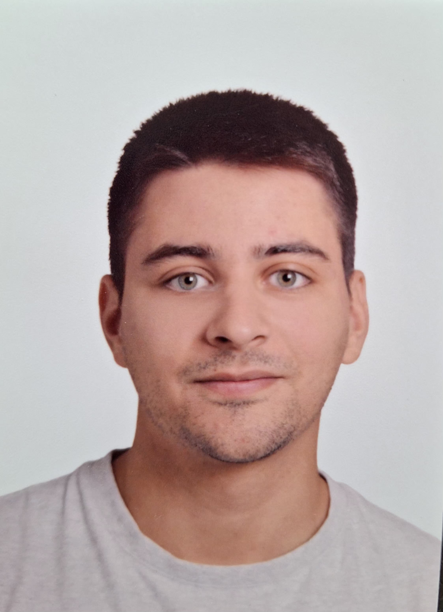

# Sandro Rodríguez Muñoz

**Mathematics · Physics · Computer Science**

## About Me

Hello! My name is Sandro, and I am a PhD student at **Université Paris-Saclay** (Gif-sur-Yvette, France) and **Macquarie University** (Sydney, Australia).

I was born in Spain, and have spent most of my life in the beautiful city of Sevilla, I recommend everyone to visit it at least once!

I did my bachelor's in Physics at the UCM (Universidad Complutense de Madrid) and my master's in mathemtics at the UGR (Universidad de Granada).

My native language is Spanish, but I also speak English, a bit of German and I am currently learning French. I plan to keep learning German in the future, but of course French has become my priority at the moment.

In my free time I like to make [teaching material](teaching/teaching.md)  (notes, apps, YouTube videos, etc.) about mathematics, physics, etc. It is still a work in progress, so there is not that much material yet. Any suggestions and ideas are welcome!

**Current position**
PhD Student

**Affiliations**
Université Paris-Saclay (LMF) 
Macquarie University

**Research**
Category Theory  
Differential Categories  
Categorical Quantum Mechanics  
Operator Spaces  
Quantum Mechanics

## Research Interests

...

You can find more details about my research [here](research.md)

---

## Teaching & Notes

...

[Teaching](teaching/teaching.md)

---

## Contact

For academic enquiries, collaborations, or questions about my research and educational material, etc., feel free to get in touch!

<!-- Email: [sandrorodmun@gmail.com](mailto:sandrorodmungmail.com) -->
Email: **sandrorodmun at gmail dot com**